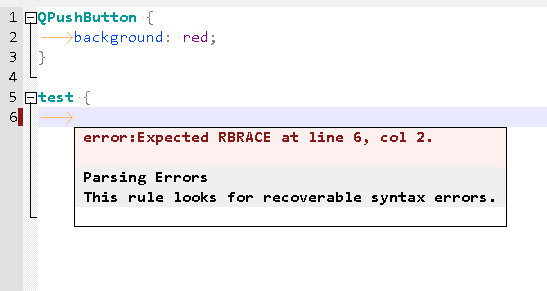

# QtDesigner

Qt Designer With Plugins

[gitee mirror](https://gitee.com/PyQt5/QtDesigner)

## Platform

1. [Windows](Windows)
2. [Linux](Linux)

## TODO

- [x] PyQt5 plug-in, you can use PyQt5 to write custom controls
- [x] Style editor with auto-complete, QSS format, QSS lint
- [x] Ui Files Workspace
- [ ] linguist.exe with multi language translation
- [ ] assistant.exe with translation

## Notice

1. For Linux platform needs to run `designer.sh` file and it will take a while to display.
2. If you want use `assistant`, You need to download the doc document from [https://github.com/PyQt5/PyQt/releases](https://github.com/PyQt5/PyQt/releases) and put it in the `Docs` folder, like `Windows/Docs/Qt-5.15.0` or `Linux/Docs/Qt-5.15.0`

## Download

https://github.com/PyQt5/QtDesigner/releases

https://gitee.com/PyQt5/QtDesigner/releases

## ScreenShot

PyQt5 Plugin

Workspace Plugin

QSS Editor Plugin

